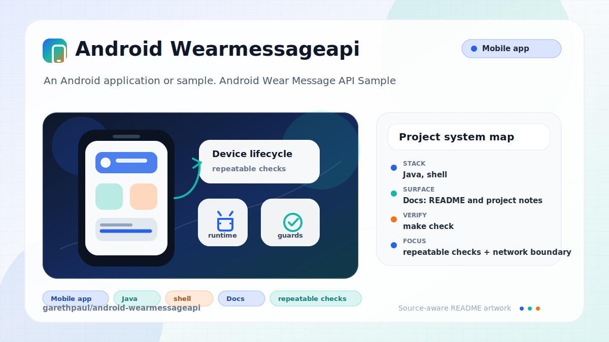

# android-wearmessageapi

<!-- README-OVERVIEW-IMAGE -->


## Overview

`garethpaul/android-wearmessageapi` is an Android application or sample. Android Wear Message API Sample

This README is based on the checked-in source, manifests, scripts, and repository metadata on the `master` branch. The project language mix found during review was: Java (8), shell (1).

## Repository Contents

- `README.md` - project overview and local usage notes
- `build.gradle` - Android or Gradle build configuration
- `docs` - source or example code
- `gradle` - source or example code
- `gradlew` - Android or Gradle build configuration
- `mobile` - source or example code
- `scripts` - source or example code
- `SECURITY.md` - security reporting and disclosure guidance
- `VISION.md` - project direction and maintenance guardrails
- `wear` - source or example code

Additional scan context:

- Source directories: docs, gradle, mobile, scripts, wear
- Dependency and build manifests: build.gradle, gradlew
- Entry points or build surfaces: Gradle build files
- Test-looking files: mobile/src/androidTest/java/garethpaul/com/wearer/ApplicationTest.java, mobile/src/test/java/garethpaul/com/wearer/WearMessageTest.java, wear/src/test/java/garethpaul/com/wearer/WearMessageTest.java

## Getting Started

### Prerequisites

- Git
- Android Studio or a compatible Android SDK
- Gradle or the checked-in Gradle wrapper when present

### Setup

```bash
git clone https://github.com/garethpaul/android-wearmessageapi.git
cd android-wearmessageapi
make check
```

The setup commands above are derived from repository files. Legacy mobile, Python, or JavaScript samples may require older SDKs or package versions than a modern workstation uses by default.

## Running or Using the Project

- Use Android Studio to open the project or run `./gradlew assembleDebug` when the Android SDK is configured.

## Testing and Verification

Run the SDK-free source baseline check first:

```sh
make check
scripts/check-baseline.sh
```

Then run Gradle after Android SDK configuration is available:

```sh
ANDROID_HOME=/home/gjones/android-sdk ./gradlew lint --no-daemon
ANDROID_HOME=/home/gjones/android-sdk ./gradlew test --no-daemon
ANDROID_HOME=/home/gjones/android-sdk ./gradlew assembleDebug --no-daemon
```

When the required SDK or runtime is unavailable, use static checks and source review first, then verify on a machine that has the matching platform toolchain.

## Configuration and Secrets

- No required secret or credential file was identified in the repository scan. If you add integrations later, keep secrets out of git.

## Security and Privacy Notes

- Review changes touching network requests, sockets, or service endpoints; examples from the scan include build.gradle, gradle.properties, mobile/src/androidTest/java/garethpaul/com/wearer/ApplicationTest.java, mobile/src/main/AndroidManifest.xml, and 6 more.
- Review changes touching mobile permissions or privacy-sensitive device data; examples from the scan include gradlew.
- Review changes touching file, media, JSON, XML, CSV, OCR, or data parsing; examples from the scan include mobile/src/main/AndroidManifest.xml, mobile/src/main/res/values-v21/styles.xml, mobile/src/main/res/values-w820dp/dimens.xml, wear/src/main/AndroidManifest.xml, and 4 more.
- Review changes touching database, model, or persistence code; examples from the scan include docs/plans/2026-06-08-wear-message-build-baseline.md.

## Maintenance Notes

- This looks like a legacy Android project or sample. Expect Android SDK, Gradle, and support-library versions to matter.
- The mobile and wear message helpers use explicit UTF-8 payloads and treat null
  text or payloads as empty values.
- See `SECURITY.md` for vulnerability reporting and safe research guidance.
- See `VISION.md` for project direction and contribution guardrails.
- See `CHANGES.md` for the maintenance history.

## Contributing

Keep changes small and tied to the project that is already present in this repository. For code changes, document the toolchain used, avoid committing generated dependency directories or local configuration, and update this README when setup or verification steps change.
